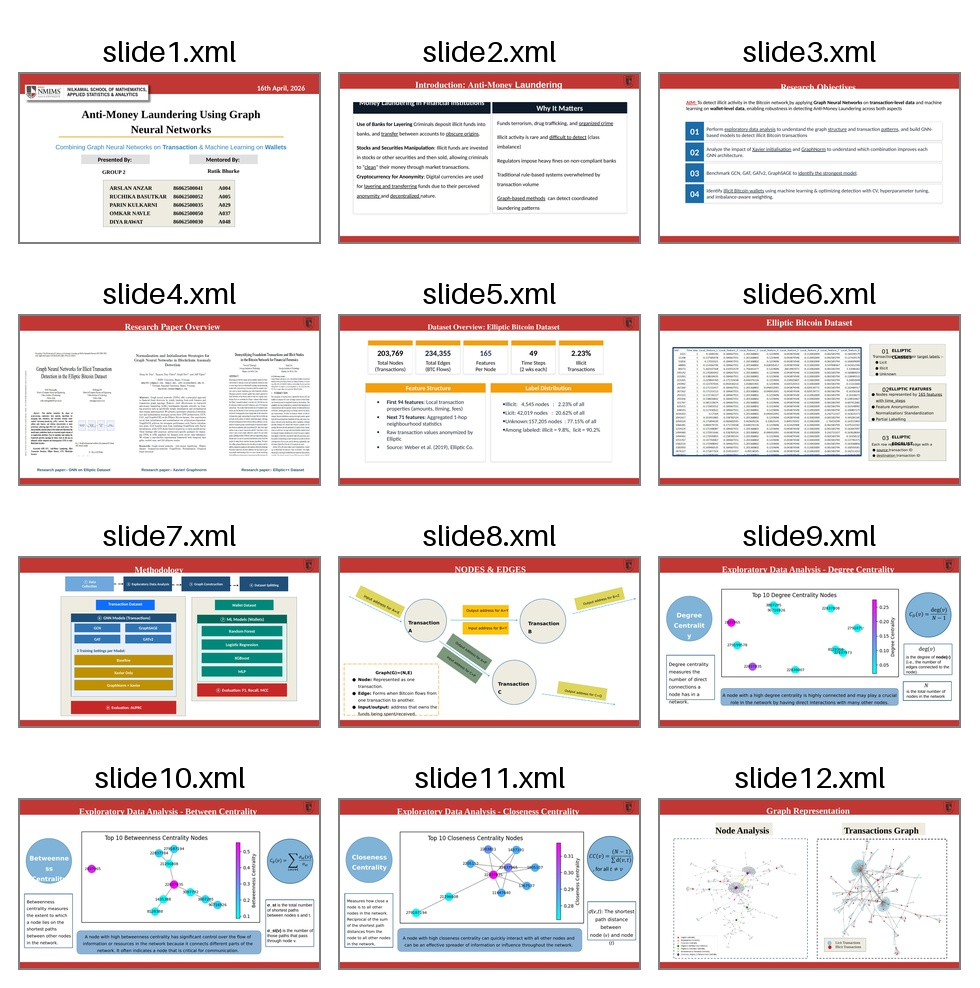
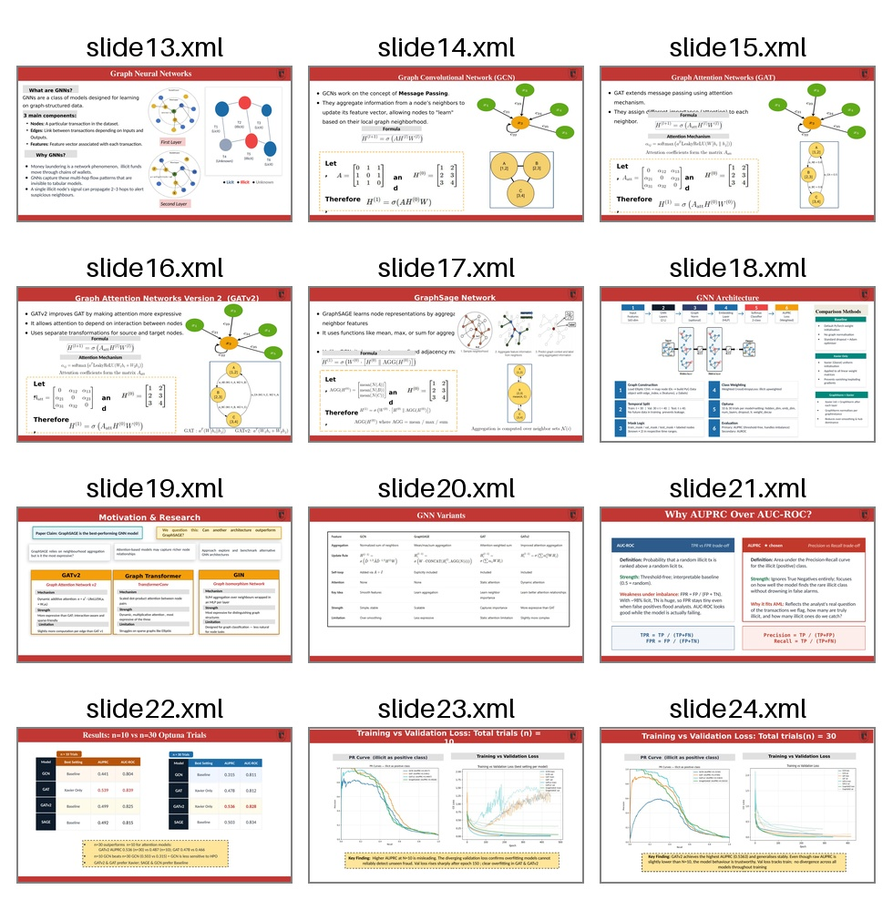
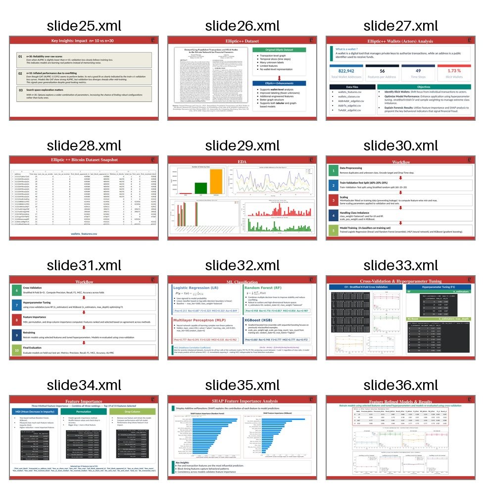
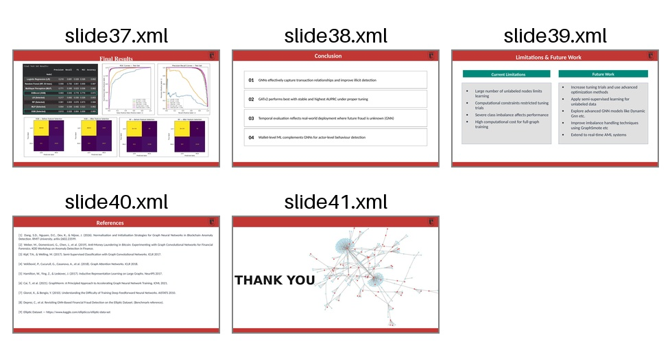

# Anti-Money Laundering Using Graph Neural Networks

> **Combining Graph Neural Networks on Bitcoin Transactions & Machine Learning on Wallet Addresses**

**NMIMS School of Mathematics, Applied Statistics & Analytics — Group 2**  
*Arslan Anzar · Ruchika Basutkar · Parin Kulkarni · Omkar Navle · Diya Rawat*  
*Mentored by: Rutik Bhurke · 16th April 2026*

---

## Overview

Money laundering costs the global economy an estimated **$800 billion–$2 trillion annually**. Traditional rule-based AML systems are overwhelmed by transaction volume and cannot detect coordinated laundering patterns that emerge across networks.

This project tackles AML from **two complementary angles**:

| Track | Dataset | Method | Objective |
|---|---|---|---|
| **Track 1 — Transactions** | Elliptic Bitcoin (203,769 nodes) | Graph Neural Networks | Detect illicit Bitcoin transactions |
| **Track 2 — Wallets** | Elliptic++ (822,942 wallets) | RF · XGBoost · MLP · LR | Identify illicit wallet addresses |

---

## Slides & Presentation









---

## Notebooks

| # | Notebook | Description | Open |
|---|---|---|---|
| 1 | `GNN_10_Trials.ipynb` | GNN ablation — 4 models × 3 settings, 10 Optuna trials | [](https://colab.research.google.com/drive/14MobE8CAeG7Qxr0a91dIPQOS6aypFRVM?usp=sharing) |
| 2 | `GNN_30_Trials.ipynb` | GNN ablation — 4 models × 3 settings, 30 Optuna trials | [](https://colab.research.google.com/drive/1FAj9awvhJR9SDEo8mVnHd0VfQzc7lqVn?usp=sharing) |
| 3 | `EDA_Transactions.ipynb` | Full EDA of the Elliptic transaction dataset | [](https://colab.research.google.com/drive/16BQe7DIcMKV1SuRZOWTi2YGq7DUJj_KU?usp=sharing) |
| 4 | `ML_Wallets.ipynb` | ML pipeline on Elliptic++ wallet addresses | [](https://colab.research.google.com/drive/1mdNa_StrgV7iQXDyVpXJCx0yrp0Eb0fl?usp=sharing) |

---

## Datasets

### Track 1 — Elliptic Bitcoin Transaction Dataset

| Property | Value |
|---|---|
| Total nodes (transactions) | 203,769 |
| Total edges (BTC flows) | 234,355 |
| Features per node | 165 (94 local + 71 aggregated neighbourhood) |
| Time steps | 49 (~2 weeks each) |
| Illicit nodes | 4,545 (2.23% of all / 9.8% of labeled) |
| Licit nodes | 42,019 (20.62% of all / 90.2% of labeled) |
| Unknown nodes | 157,205 (77.15%) |

> **Label ground truth:** Raw class `'1'` = **illicit** (positive, 2.23%), Raw class `'2'` = **licit** (negative, 20.62%).  
> Unknown nodes stay in the graph for message passing but are excluded from all masks.

📥 [Kaggle — Elliptic Data Set](https://www.kaggle.com/ellipticco/elliptic-data-set)

### Track 2 — Elliptic++ Wallets Dataset

| Property | Value |
|---|---|
| Total wallet addresses | 822,942 |
| Features per address | 56 |
| Time steps | 49 |
| Illicit wallets | 1.73% |

📥 [Kaggle — Elliptic++](https://www.kaggle.com/datasets/ellipticco/ellipticplusplus)

---

## GNN Track — Architecture & Methodology

### Models Evaluated

| Model | Key Mechanism | PyG Layer |
|---|---|---|
| **GCN** | Degree-normalised neighbourhood averaging | `GCNConv` |
| **GAT** | Static learned attention weights | `GATConv` |
| **GATv2** | Dynamic attention — strictly more expressive than GAT | `GATv2Conv` |
| **GraphSAGE** | Inductive sampling + mean/max aggregation | `SAGEConv` |

### Ablation Study — 3 Settings × 4 Models = 12 Experiments

| Setting | GraphNorm | Initialisation |
|---|---|---|
| `baseline` | ❌ | Default (Kaiming) |
| `xavier_only` | ❌ | Xavier Uniform |
| `graphnorm_xavier` | ✅ | Xavier Uniform |

### Key Design Decisions

**Temporal split — not random:**
```
Train  : time steps  1–29  (first ~15 months)
Val    : time steps 30–39
Test   : time steps 40–49  (final ~5 months — future fraud)
```
Random splits allow future fraud to "teach" the model — temporal splits reflect real deployment.

**Weighted CrossEntropyLoss:**
```python
w_illicit = n_total / (2 × n_illicit)   # ~5.1x upweight — minority class
w_licit   = n_total / (2 × n_licit)     # ~0.55x downweight
```
Without weighting, the model learns to predict "all licit" and achieves 90% accuracy while catching zero fraudsters.

**AUPRC as primary metric:**
A random classifier achieves AUPRC ≈ 9.8% (= positive rate). Our models at AUPRC > 0.50 represent a 5× improvement over random. Standard accuracy is misleading on 90/10 imbalanced data.

**Optuna TPE hyperparameter search:**
Bayesian optimisation using Tree-structured Parzen Estimator. Searches over: `hidden_dim`, `embedding_dim`, `num_layers`, `dropout`, `lr`, `n_epochs`, `weight_decay`.

### Results

#### 10 Trials vs 30 Trials Comparison

| Model | Best Setting | AUPRC (n=10) | AUPRC (n=30) |
|---|---|---|---|
| GCN | Baseline | 0.441 | 0.441 |
| GAT | Baseline | 0.233 | 0.531 |
| **GATv2** | **Xavier Only** | **0.499** | **0.534** |
| SAGE | Baseline | 0.492 | 0.521 |

> **Key insight — n=10 vs n=30:** With n=30, reliability improves over raw scores. Val loss closely follows training loss — models learn real patterns rather than memorising. GATv2 achieves the highest AUPRC (0.534) and shows stable training behaviour. Search space exploration matters: Optuna explores a wider combination of parameters, increasing the chance of finding robust configurations.

---

## ML Track — Wallet-Level Detection

### Pipeline (10 Steps)

```
Data Preprocessing → Train/Val/Test Split (60/20/20 stratified) →
MinMax Scaling → Class Imbalance Handling → Model Training →
Cross-Validation (Stratified K-Fold k=5) → Hyperparameter Tuning →
Feature Importance (MDI + Permutation + Drop-Column) →
Retraining on Selected Features → Final Evaluation
```

### Initial Results (All 56 Features)

| Model | Precision | Recall | F1 | MCC | Accuracy |
|---|---|---|---|---|---|
| Logistic Regression | 0.211 | 0.687 | 0.323 | 0.323 | 0.849 |
| **Random Forest** | **0.958** | **0.776** | **0.857** | **0.856** | **0.987** |
| MLP | 0.777 | 0.391 | 0.520 | 0.535 | 0.962 |
| XGBoost | 0.660 | 0.946 | 0.777 | 0.777 | 0.972 |

**Random Forest** achieves the best precision-recall balance. **XGBoost** has the highest recall (catches more fraudsters at the cost of more false alarms).

> **Why MCC?** Matthews Correlation Coefficient accounts for all four cells of the confusion matrix (TP, TN, FP, FN). A model predicting all-licit achieves MCC ≈ 0, immediately exposing it — unlike accuracy (98%+) which hides the failure.

### Feature Selection — Three-Method Agreement

Top 19 of 56 features selected via MDI + Permutation + Drop-Column agreement:

```
fees-related  : fees_min, fees_max, fees_mean, fees_median, fees_total,
                fees_as_share_min, fees_as_share_max, fees_as_share_mean,
                fees_as_share_median, fees_as_share_total
timing        : first_sent_block, last_block_appeared_in,
                first_block_appeared_in, first_received_block
volume        : btc_received_median, btc_sent_max, btc_sent_total,
                btc_transacted_max
network       : transacted_w_address_total, total_txs
```

> Fee and timing features are the strongest predictors — confirmed by SHAP across both RF and XGBoost.

---

## Repository Structure

```
AML-GNN/
├── README.md                          ← This file
├── SETUP.md                           ← Reproduction guide
├── requirements.txt                   ← Python dependencies
├── .gitignore
├── notebooks/
│   ├── GNN_10_Trials.ipynb            ← GNN ablation — 10 Optuna trials
│   ├── GNN_30_Trials.ipynb            ← GNN ablation — 30 Optuna trials
│   ├── EDA_Transactions.ipynb         ← Full EDA of Elliptic dataset
│   └── ML_Wallets.ipynb               ← ML models on Elliptic++ wallets
├── reports/
│   ├── Final_Report.docx              ← Full project report
│   └── Presentation.pptx              ← Slides
├── assets/
│   └── images/                        ← Slide exports used in this README
└── docs/
    └── methodology.md                 ← Deep-dive on all design decisions
```

---

## Conclusions

1. **GNNs effectively capture transaction-level fraud patterns** — graph topology provides signal that node features alone cannot deliver. Illicit transactions cluster in the network and exhibit unusual neighbourhood statistics.

2. **GATv2 performs best among GNN architectures** — dynamic attention produces the highest AUPRC (0.534) with stable training behaviour. Val loss tracks train loss with no divergence.

3. **Temporal evaluation is non-negotiable** — random splits inflate results by leaking future fraud patterns into training. The temporal split reflects real deployment where future fraud is genuinely unknown.

4. **n=30 Optuna trials significantly outperforms n=10** — wider search space exploration finds more robust configurations rather than lucky ones.

5. **Wallet-level ML complements GNN transaction detection** — Random Forest on Elliptic++ wallet features provides a second layer at the actor level, achieving MCC=0.856.

6. **Xavier initialisation consistently helps** — particularly for GATv2. GraphNorm benefits are architecture-dependent.

---

## Limitations & Future Work

| Current Limitation | Future Direction |
|---|---|
| 77% unlabeled nodes limits supervised signal | Semi-supervised learning on unknown nodes |
| Computational constraints capped Optuna trials | Increase to 100+ trials with better hardware |
| Full-graph training is memory-intensive | GraphSAINT / mini-batch sampling |
| Severe class imbalance affects all models | GraphSMOTE for graph-level oversampling |
| Static graph — no edge-level timing | Temporal GNNs (TGN, TGAT) |
| Single dataset evaluation | Extend to Elliptic2 subgraph-level dataset |

---

## References

1. Dang, S.D., Nguyen, D.C., Dev, K., & Nijsse, J. (2026). *Normalisation and Initialisation Strategies for Graph Neural Networks in Blockchain Anomaly Detection.* arXiv:2602.23599.
2. Weber, M., et al. (2019). *Anti-Money Laundering in Bitcoin: Experimenting with Graph Convolutional Networks for Financial Forensics.* KDD Workshop on Anomaly Detection in Finance.
3. Kipf, T.N., & Welling, M. (2017). *Semi-Supervised Classification with Graph Convolutional Networks.* ICLR 2017.
4. Veličković, P., et al. (2018). *Graph Attention Networks.* ICLR 2018.
5. Hamilton, W., Ying, Z., & Leskovec, J. (2017). *Inductive Representation Learning on Large Graphs.* NeurIPS 2017.
6. Cai, T., et al. (2021). *GraphNorm: A Principled Approach to Accelerating Graph Neural Network Training.* ICML 2021.
7. Glorot, X., & Bengio, Y. (2010). *Understanding the Difficulty of Training Deep Feedforward Neural Networks.* AISTATS 2010.
8. Elmougy, Y., & Liu, L. (2023). *Demystifying Fraudulent Transactions and Illicit Nodes in the Bitcoin Network for Financial Forensics.* KDD '23.
9. Elliptic Dataset — https://www.kaggle.com/ellipticco/elliptic-data-set

---

## License

This project is for academic purposes. Dataset usage governed by [Elliptic Terms of Use](https://www.kaggle.com/ellipticco/elliptic-data-set).
